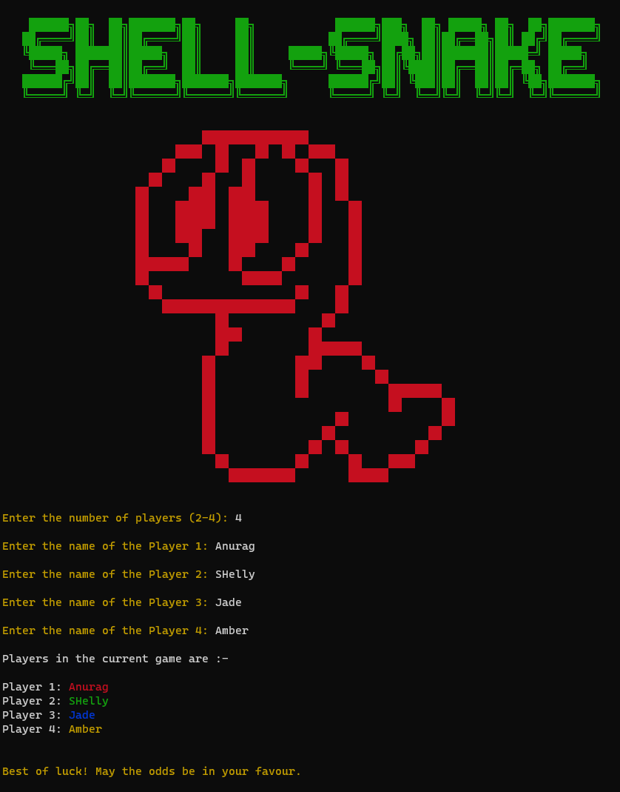

# *Shell-Snake*

     
[][page]

### A GUI-Independent and Modular CLI Snakes and Ladders game

***Shell-Snake*** is a modular terminal-based game of snakes and ladders written in around 70 lines of code.  
***Shell-Snake*** allows you to choose your own game board from the available presets and also allows you to make or download and add your own board to the game.  
It also displays the current board being used in a window beside for better gameplay.

### Checkout the demo video here --> [https://youtu.be/Aa9L9hZfMOQ](https://youtu.be/Aa9L9hZfMOQ)

### [CODE OF CONDUCT](CODE_OF_CONDUCT.md)

### [CONTRIBUTING](CONTRIBUTING.md)

### Requirements :- 
 - [Python 3][py]

 - [Pip][pp]

### Installation & Usage :-
 - Download the latest release from [RELEASES][RELEASES]
 
 - Extract the archive

 - Double-Click on ***requirements.bat*** to install all the requirements
 
 - Double-Click on ***play.bat*** to launch the game. Enjoy :)
 
 - A default board is already selected to use with the game
 
 - You can change the board to use by renaming the respective *Board.bin* and *Board_pic.jpg* file to ***Game.bin*** and ***Game_pic.jpg*** file respectively
 
 - You can create your custom boards by adding new *Board.bin* and *Board_pic.jpg* files
 
 - Board creation guide will be included soon

### Highlights :-
 - Can be played with upto 4 players together
 
 - You can make your own boards and add it to the game
 
 - By default, 4 boards are provided in the ***Boards*** folder
 
 - Is colorful. Provides colored event-based visual responses
 
### Legend/Color schemes :-
 - MAGENTA -->  FOR MARKING PLAYER 1

 - YELLOW  -->  FOR MARKING USER INPUT AND OUTPUT / PLAYER 2

 - BLUE    -->  FOR MARKING THE WINNER / PLAYER 3
 
 - RED     -->  FOR MARKING SNAKE EVENTS / PLAYER 4

 - CYAN    -->  FOR MARKING DICE VALUES
 
 - GREEN   -->  FOR MARKING LADDER EVENTS / ROLLING DICE

 - GRAY    -->  FOR MARKING ALERTS

 - RESET   -->  FOR RESETTING TO DEFAULT SHELL COLOR

### Reporting :-
 - Report BUGS at [( https://github.com/7Ragnarok7/Shell-Snake/issues )](https://github.com/7Ragnarok7/Shell-Snake/issues)
 - Reporting guide/template [can be found here.](.github/ISSUE_TEMPLATE)

### Feedback :-
 - Share your feedback and discuss about the project at [(https://github.com/7Ragnarok7/Shell-Snake/discussions)](https://github.com/7Ragnarok7/Shell-Snake/discussions)

[//]: # "References below:-" 

[py]:<https://www.python.org>
[pp]:<https://pip.pypa.io/en/stable/installing>
[page]:<https://7Ragnarok7.github.io/Shell-Snake/>
[RELEASES]:<https://github.com/7Ragnarok7/Shell-Snake/releases>
